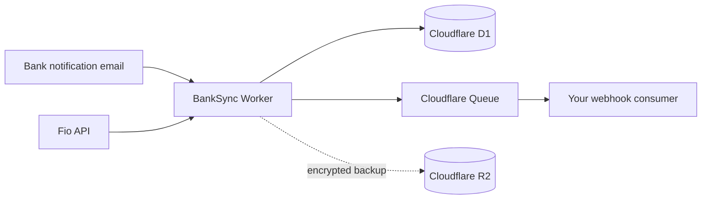

<h1 align="center">BankSync</h1>

<p align="center"><strong>Bank notifications in. Verified, deduplicated webhooks out.</strong></p>

<p align="center">
  <a href="https://www.npmjs.com/package/@festapp/banksync"></a>
  <a href="https://github.com/festappnet/banksync/actions/workflows/check.yml"></a>
  <a href="https://github.com/festappnet/banksync/actions/workflows/security.yml"></a>
  <a href="LICENSE"></a>
</p>

BankSync is a TypeScript package and a deployable Cloudflare Worker for turning
Czech bank transaction notifications into durable, signed webhook events. It
hides email authentication, parsing, pairing, deduplication, retries, secret
handling, and delivery recovery behind one small consumer interface.

```text
receive bank activity → authenticate → normalize → deduplicate → deliver durably
```

## At a glance

| | |
|---|---|
| **Inputs** | Fio Bank email, Fio API, Air Bank email |
| **Output** | Signed `transaction.received` webhook, version `1` |
| **Runtime** | Cloudflare Workers, Email Routing, D1 and Queues; optional R2 |
| **Package** | Runtime-neutral helpers plus a separate Cloudflare Worker export |
| **Safety model** | Tenant ownership, authenticated email identity, durable idempotency and exact-host callback policy |



## Choose your path

| You want to… | Start here |
|---|---|
| Verify BankSync webhooks in an application | [Install the package](#install-the-package) and use `verifyWebhook` |
| Run your own BankSync ingestion Worker | [Deploy the Worker](#deploy-the-worker) |
| Understand the signed event format | [Webhook contract](#webhook-contract) |
| Review the security assumptions | [Security model](#security-model) |
| Contribute to BankSync | [Development](#development) |

## Install the package

`v0.1.0` is an unsafe preview and must not be used in production. Install the
current npm release produced by the protected release workflow:

```bash
pnpm add @festapp/banksync
```

The root export is runtime-neutral. A typical consumer needs only the high-level
verifier:

```ts
import {
  verifyWebhook,
  type WebhookEnvelope,
} from "@festapp/banksync";

const bodyBytes = new Uint8Array(await request.arrayBuffer());

const envelope: WebhookEnvelope = await verifyWebhook({
  secret,
  timestamp: request.headers.get("x-banksync-timestamp") ?? "",
  deliveryId: request.headers.get("x-banksync-delivery-id") ?? "",
  signature: request.headers.get("x-banksync-signature") ?? "",
  bodyBytes,
});

// Claim envelope.delivery_id atomically in durable storage before billing or
// any other side effect. Signature verification is not replay persistence.
```

Other root exports cover provider detection and email parsing, payment-reference
resolution, Fio API mapping, currency normalization, ISO 11649 references, and
webhook signing. The Cloudflare implementation stays behind a separate export,
so application code does not pull in Worker bindings:

```ts
export { default } from "@festapp/banksync/cloudflare";
export type { Env } from "@festapp/banksync/cloudflare";
```

## What the Worker handles

- authenticates sender and recipient identity from Cloudflare-owned envelope
  evidence and a configured trusted `Authentication-Results` authserv-id;
- parses supported Fio Bank and Air Bank notifications and can poll the Fio API;
- pairs each notification through a per-account receiver address;
- normalizes transaction data and deduplicates it in D1;
- creates durable delivery jobs and retries them through Cloudflare Queues;
- heals stalled delivery state without repeating a completed consumer outcome;
- encrypts stored credentials and optional R2 backup envelopes;
- records administrative audit events and applies bounded retention;
- exposes only coarse public health while protecting detailed operator routes.

## Deploy the Worker

### Prerequisites

- Node.js 20 or newer and pnpm;
- a Cloudflare account with Workers, D1, Queues and Email Routing;
- an R2 bucket only if encrypted backups are enabled;
- exact callback hostnames for every intended webhook consumer.

### Setup

1. Clone this repository and run `pnpm install`.
2. Copy [`wrangler.example.toml`](wrangler.example.toml) to `wrangler.toml` and
   replace every resource placeholder.
3. Create the D1 database and queues named by the configuration.
4. For a fresh database, apply `migrations/0001_schema.sql`. For a production
   database whose recorded history ends at `0009`, apply only
   `migrations/0010_security_hardening.sql` through a scoped, reviewed migration.
5. Configure `ADMIN_SECRET`, `WEBHOOK_KEK`, `ENCRYPTION_KEY_V1`, and—when R2
   backups are enabled—the selected `BACKUP_ENCRYPTION_KEY_Vn` with
   `pnpm wrangler secret put <NAME>`.
6. Set `CALLBACK_HOST_ALLOWLIST` to exact consumer hostnames. Production rejects
   an empty policy, credentials, IP literals, special-use hosts, suffix matches,
   fragments and redirects.
7. Inspect sanitized accepted and rejected Cloudflare messages, establish the
   Cloudflare-owned authserv-id, and set `EMAIL_AUTHSERV_ID`. Email ingestion
   deliberately remains disabled until this value is known; MIME headers are
   never used as an identity fallback.
8. Run `pnpm check`, review the dry-run artifact, and deploy the composition you
   have configured.

All key families must use independent random 32-byte base64 values. Keep backup
keys outside R2 and prove restore before rotation. Never commit `wrangler.toml`,
`.dev.vars`, bank API tokens, backup keys or webhook secrets.

### Migration rules

Fresh databases use the single canonical baseline `0001_schema.sql`, which
creates schema version 10. Existing databases retain their recorded `0001`–`0009`
history and advance through `0010_security_hardening.sql`. Future migrations
must start at `0011`; never renumber or replace the baseline.

BankSync D1 is intentionally independent of consumer billing databases.
BankSync emits authenticated transaction facts. Each consumer owns settlement,
invoicing and its own durable delivery claim.

For local development, use placeholder Cloudflare identifiers, copy
`.dev.vars.example` to `.dev.vars`, apply migrations locally, then run:

```bash
pnpm dev
```

## Webhook contract

BankSync sends event `transaction.received` with `event_version: 1`.
`delivery_id` is stable across retries and is the consumer's idempotency key.
Each request includes:

- `X-BankSync-Timestamp`
- `X-BankSync-Delivery-Id`
- `X-BankSync-Signature: sha256=<hex>`

The HMAC input is the exact byte sequence:

```text
timestamp + "." + deliveryId + "." + bodyBytes
```

Verify the raw body before JSON parsing. `verifyWebhook` validates the raw-body
HMAC, timestamp syntax and tolerance, delivery header/body equality, event name
and event version. Failure throws `WebhookVerificationError` with a stable code.
There is intentionally no public HMAC-only verifier.

## Security model

- **Email trust:** Cloudflare Email Routing is the SMTP/envelope seam. A message
  needs a configured trusted auth result plus aligned DKIM or DMARC and exact
  agreement between envelope and MIME identities.
- **Tenant authority:** `bank_accounts.owner_app_id` decides who may operate on
  an account. Only an administrator may create a cross-owner subscription.
- **Callback egress:** every attempt revalidates the current exact-host policy
  immediately before fetch and never follows redirects.
- **Replay handling:** BankSync keeps delivery IDs stable; consumers must claim
  them atomically in their own durable storage before side effects.
- **Credential handling:** credential creation and rotation reject
  `Idempotency-Key`; their plaintext responses never enter the idempotency cache.
- **Operator visibility:** public HTTP exposes only `GET /health`. `/status` and
  `/health/deep` require administrator authentication.
- **Backups:** optional R2 backups are AES-256-GCM `.sql.enc` envelopes and omit
  ephemeral idempotency and rate-limit tables.

Decrypt a backup into a new mode-0600 file without printing plaintext:

```bash
BACKUP_DECRYPTION_KEY='<base64 key>' \
  node scripts/decrypt-backup.mjs backup.sql.enc restored.sql
```

For the full rollout and rollback rules, see
[`docs/security-hardening-rollout.md`](docs/security-hardening-rollout.md).

## Development

```bash
pnpm check
pnpm pack --dry-run
```

`pnpm check` runs type checking, the complete test suite, dual ESM/CommonJS
builds, and package-export verification. Provider-live tests are intentionally
outside the default suite and must never use production bank credentials.

Stable releases are created from protected `v*` tags by GitHub Actions, publish
to npm through OIDC trusted publishing, and attach the exact same tarball,
checksum, provenance and SBOM to the GitHub Release.

## License

[MIT](LICENSE) © Festapp
